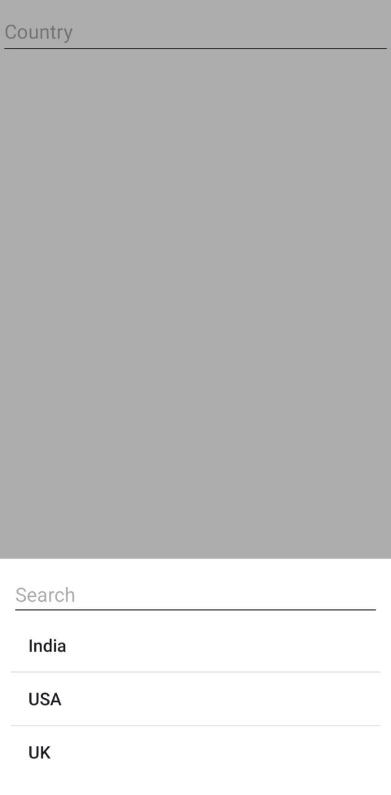
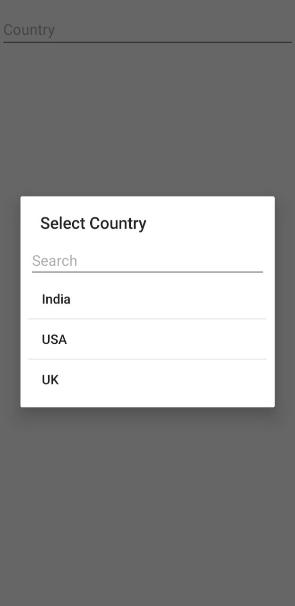

## SmartMaterialSpinner
[](https://kotlinlang.org/)
[](LICENSE)
[](#)
---

A lightweight, customizable Material Design spinner for Android with support for Dialog / BottomSheet mode and searchable items, written in Kotlin.

### Features

- Material Design based
- Dialog or BottomSheet mode (XML configurable)
- Built-in search support
- Simple and clean API
- Custom XML attributes
- Kotlin-first
- Easy to integrate

---

## Preview

<p align="center">
<table>
  <tr>
    <td align="center">
      
    </td>
    <td align="center">
      
    </td>
  </tr>
</table>
</p>


---

## Installation (JitPack)

### 1️⃣ Add JitPack to your **root `settings.gradle` or `build.gradle`**

```gradle
dependencyResolutionManagement {
    repositories {
        google()
        mavenCentral()
        maven { url 'https://jitpack.io' }
    }
}
```
### Add Dependency
```
dependencies {
	        implementation 'com.github.Excelsior-Technologies-Community:Android_SmartMaterialSpinner:1.0.1'
	}
```

---

## Usage

### Xml
```xml
<com.ext.smartmaterialspinner.SmartMaterialSpinner
    android:id="@+id/smartSpinner"
    android:layout_width="match_parent"
    android:layout_height="wrap_content"
    android:hint="Select Country"
    app:spinnerMode="bottomSheet"
    app:enableSearch="true"
    app:spinnerTitle="Select Country"/>
```

### Kotlin
```kotlin
smartSpinner.setItems(
    listOf("India", "USA", "UK", "Canada")
)

smartSpinner.setOnItemSelectedListener { item, position ->
    Toast.makeText(this, "Selected: $item", Toast.LENGTH_SHORT).show()
}
```

---

## XML Attributes

| Attribute        | Type    | Default | Description                              |
|------------------|---------|---------|------------------------------------------|
| spinnerMode      | enum    | dialog  | Display mode: `dialog` or `bottomSheet`  |
| enableSearch     | boolean | false   | Enable or disable search functionality   |
| spinnerTitle     | string  | null    | Optional title for dialog or bottom sheet|

---

## License

```
MIT License

Copyright (c) 2025 Excelsior Technologies 

Permission is hereby granted, free of charge, to any person obtaining a copy
of this software and associated documentation files (the "Software"), to deal
in the Software without restriction, including without limitation the rights
to use, copy, modify, merge, publish, distribute, sublicense, and/or sell
copies of the Software, and to permit persons to whom the Software is
furnished to do so, subject to the following conditions:

The above copyright notice and this permission notice shall be included in all
copies or substantial portions of the Software.

THE SOFTWARE IS PROVIDED "AS IS", WITHOUT WARRANTY OF ANY KIND, EXPRESS OR
IMPLIED, INCLUDING BUT NOT LIMITED TO THE WARRANTIES OF MERCHANTABILITY,
FITNESS FOR A PARTICULAR PURPOSE AND NONINFRINGEMENT. IN NO EVENT SHALL THE
AUTHORS OR COPYRIGHT HOLDERS BE LIABLE FOR ANY CLAIM, DAMAGES OR OTHER
LIABILITY, WHETHER IN AN ACTION OF CONTRACT, TORT OR OTHERWISE, ARISING FROM,
OUT OF OR IN CONNECTION WITH THE SOFTWARE OR THE USE OR OTHER DEALINGS IN THE
SOFTWARE.
```


